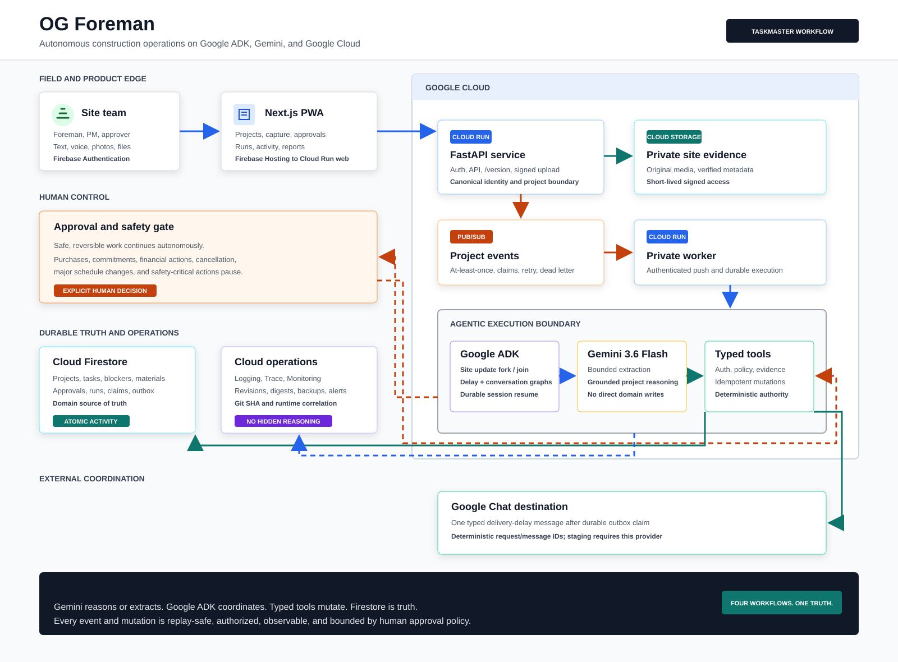

# OG Foreman Submission Architecture

The canonical editable diagram is
[architecture-diagram.mmd](architecture-diagram.mmd). The submission-ready
render is [architecture-diagram.svg](architecture-diagram.svg).



## Devpost architecture explanation

OG separates project setup from autonomous operations. Project initialization
uses Gemini directly for schema-constrained extraction, then deterministic
validation, human review, and a typed transactional commit to Firestore; it is
not an ADK workflow. Once a project is live, authenticated text, voice, photos,
and delivery events become durable ProjectEvents. A private Cloud Run worker
runs the matching Google ADK workflow, Gemini reasons only where interpretation
is needed, and typed tools plus deterministic domain services enforce every
mutation. Consequential actions persist an approval and pause the same logical
ADK execution until an authenticated decision triggers native continuation.
Firestore remains the source of truth, while ActivityEvent, AgentRun, Cloud
Logging, and Cloud Trace provide the audit trail. Delivery delays autonomously
update project risk and use a durable outbox to persist one truthful external
outcome: sent through Google Chat when configured, or skipped when staging
explicitly disables delivery.

## Truthful boundaries

### Project initialization

```text
project source
-> direct Gemini structured extraction
-> import draft
-> deterministic schema, identity, and conflict validation
-> human review and correction
-> deterministic typed-service commit
-> Firestore
```

This path intentionally bypasses ADK. Gemini returns typed candidate data; it
cannot commit projects, tasks, dependencies, materials, or inventory.

### Agentic operations

```text
authenticated voice / photo / text / delivery event
-> FastAPI event intake
-> Pub/Sub ProjectEvent
-> private Cloud Run worker
-> Google ADK Runner and selected workflow
-> Gemini reasoning where required
-> canonical entity resolution
-> typed tools
-> deterministic domain services
-> Firestore
```

The diagram names only production-used Runner roots:

- `daily_site_update_workflow` owns the Golden site-update graph, including
  authorized context, Gemini interpretation, canonical resolution, parallel
  progress/blocker/material branches, merge, policy, tools, approval, report,
  and completion;
- `delivery_delay_workflow` owns canonical request retrieval, dependency
  impact, delayed-request mutation, risk, follow-up, outbox notification, and
  completion;
- `agentic_project_conversation` owns grounded project conversation and safe
  tool routing;
- `project_event_workflow` is the compatibility root for remaining registered
  non-site events and is not presented as multi-agent orchestration.

### Human approval

The consequential-action boundary persists the approval and original ADK app,
session, invocation, and workflow identifiers. Approval or rejection enters
through the authenticated, version-checked API and emits a durable event. The
Runner continues the same logical execution; typed tools and persisted claims
ensure the approved action happens at most once. The diagram does not depict a
reconstructed callback as durable continuation.

### External production systems

The real inbound boundary is an authenticated supplier/operator delivery-delay
report. The production outbound destination is one configured Google Chat
webhook; preview/staging may explicitly disable it. Enabled notification intent
is persisted before sending, claimed outside the Firestore transaction, retried
with bounded backoff, and completed only after the provider outcome is durable.
Disabled intent becomes a terminal skipped record with no network attempt.
Supplier simulators, in-memory gateways, and logging-only providers are
test/development fakes and are excluded from deployed wiring.

### Observability

Cloud Logging and Cloud Trace correlate the allowlisted request, event, run,
workflow, agent, node, tool, outbox, provider, and status identifiers. Every
domain mutation atomically emits an `ActivityEvent`. `AgentRun` is an
authorized product projection of execution state, not the ADK execution cursor.
Prompts, secrets, unrestricted model output, and chain-of-thought are excluded.

## Numbered data-flow legend

1. A schedule, scope, or material source is sent directly to Gemini's structured import extractor.
2. Gemini returns schema-constrained candidate data as an import draft.
3. Deterministic code validates schema, canonical identity, aliases, dependencies, quantities, and conflicts.
4. A human reviews and corrects the draft rather than allowing model output to commit itself.
5. Confirmation invokes deterministic typed services and one transactional Firestore commit.
6. **Golden:** an authenticated foreman submits the text, voice, and photo site update.
7. Intake validates authorization and evidence, assigns stable IDs, persists the source record, and emits a normalized ProjectEvent.
8. Pub/Sub delivers at least once; the private worker claims the event idempotently.
9. The worker selects the registered production ADK application and invokes `Runner` with durable session state.
10. **Golden:** `daily_site_update_workflow` owns the operational sequence.
11. Gemini interprets the authorized evidence into bounded, typed site facts; it receives no write authority.
12. Deterministic resolution maps references to canonical task and material IDs and rejects ambiguity or negation.
13. ADK fans out progress, blocker, and material analysis branches.
14. ADK joins the branch results and deterministic policy classifies safe actions versus approval-required actions.
15. Typed tools apply authorized progress, blocker, inventory, shortage, material-request, and Daily Log changes through domain services.
16. **Golden:** later, an authenticated supplier/operator reports `DELIVERY_DELAYED` for the canonical material request.
17. The same intake, Pub/Sub, worker, and Runner boundary selects `delivery_delay_workflow`.
18. The delay workflow retrieves the authorized request, canonical material, directly affected tasks, and downstream dependencies.
19. Typed tools mark the request delayed and create or update the risk and follow-up exactly once.
20. Domain services validate versions and claims, commit state atomically, and emit matching ActivityEvents.
21. A purchase or other consequential action reaches the explicit approval boundary.
22. Approval state plus the ADK execution identifiers are persisted before the workflow pauses.
23. A human approves or rejects the exact pending version.
24. The authenticated decision is persisted and emitted as a replay-safe continuation event.
25. Google ADK natively continues the same logical application/session/invocation/workflow execution.
26. The approved typed action executes once; rejection completes without the external commitment.
27. The delivery workflow persists one deterministic outbox item, then either claims and sends through Google Chat or atomically records staging delivery as skipped before completing its notification node.

## Golden Scenario visual key

The thick red path and red-bordered nodes are the competition-critical Golden
Scenario. Blue nodes are project initialization, teal nodes are real but
non-Golden runtime paths, green is durable domain truth, gray is observability,
and dashed gray denotes test-only components that are not wired in deployed
staging or production.

## Evidence caveat

The diagram describes the implemented production boundaries; it is not proof
that the final revision passed them. Submission evidence must still show the
same deployed Git SHA across `/api/v1/version`, Cloud Run revisions, the live
Gemini Golden run, native approval continuation after worker replacement,
Firestore state, one truthful external sent-or-skipped outcome, ActivityEvent history,
AgentRun terminal state, and correlated Logging/Trace identifiers.

## References

- [Production agent inventory](AGENT_INVENTORY.md)
- [Judge testing instructions](TESTING.md)
- [Public architecture contract](../ARCHITECTURE.md)
- [Workflow state machines](../WORKFLOWS.md)
- [Tool contracts](../TOOL_CONTRACTS.md)
